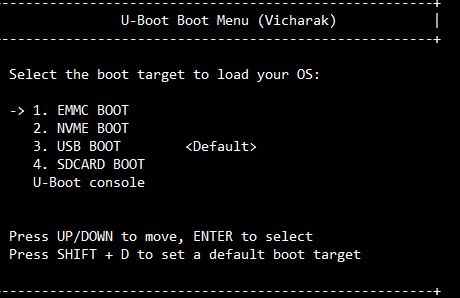

# Axon U-Boot User Guide

This document provides instructions for:

* Flashing OS images to supported storage devices
* Accessing the U-Boot via HDMI and keyboard
* Using the interactive boot menu
* Installing U-Boot using APT

---

## Supported Boot Devices

The Axon U-Boot supports booting from the following storage devices:

* USB Drive
* NVMe SSD
* SD Card
* eMMC

---

## Flashing Images to Storage Devices

**Caution**: Be sure to use the correct device path (e.g., `/dev/sdX`, `/dev/nvme0n1`) to avoid overwriting important data.

[Download eMMC Image](https://drive.google.com/file/d/1BYcnlJjHHNbGBsgnQMTn5ydN8Gc7QB-e/view?usp=drive_link)

[Download Raw Image](https://drive.google.com/file/d/1Zz_FKpvpcDQBfyncV0C8VQCTakyDlAzD/view?usp=drive_link)

Note : Raw image can be used in SD Card, NVMe and USB Storage Media device.


Uncompressed Image
------------------

```bash
tar -xvf <download_image.tar.gz>
```

### Flashing to eMMC

Refer to the detailed guide:
**[eMMC Flashing Guide (Vicharak Docs)](https://docs.vicharak.in/vicharak_sbcs/axon/axon-linux/linux-usage-guide/)**

### Flashing to NVMe SSD

```bash
sudo dd if=<image-name> of=/dev/nvme0n1 status=progress; sync
```

### Flashing to SD Card

```bash
sudo dd if=<image-name> of=/dev/sdX status=progress; sync
```

### Flashing to USB Drive

```bash
sudo dd if=<image-name> of=/dev/sdX status=progress; sync
```

### Verifying the Flash

After flashing, verify the image:

```bash
sudo fdisk -l /dev/<device>
```

Example output:

```
Device          Start     End     Sectors   Size Type
/dev/<device>1   16384    24575     8192     4M  Linux filesystem
/dev/<device>2   24576    32767     8192     4M  Linux filesystem
/dev/<device>3   32768  1081343  1048576   512M  Linux filesystem
/dev/<device>4 1081344  1671167   589824   288M  Linux filesystem
/dev/<device>5 1671168  2195455   524288   256M  Linux filesystem
/dev/<device>6 2195456 13420510 11225055   5.4G  Linux filesystem
```

#### Check Root Filesystem with `fsck`

The root partition is typically the **6th partition** (e.g., `/dev/sdX6` or `/dev/nvme0n1p6`).

```bash
sudo fsck -f /dev/<device>6
```

You should see output like:

```
fsck from util-linux 2.37
e2fsck 1.46.2 (28-Feb-2021)
/dev/sdb6: clean, 12345/456789 files, 78901/7890123 blocks
```

**Caution**: If `fsck` reports serious errors or can't read the partition or recover from, recheck your `dd` command or reflash the image.

---

### First Boot Behavior

When booting from a newly flashed storage device, Axon will perform an initial setup (first boot configuration) and then automatically reboot.

**Important:** After the reboot, Axon will not automatically boot from the same storage device unless it has been explicitly set as the default. Simply selecting the device once from the boot menu does not persist across reboots.

To ensure Axon boots from the same storage medium after first boot:

* Either **reselect** the storage device from the boot menu after reboot, or
* **Set it as the default** before the first boot, so it will be used automatically after reboot.

### Unique PARTUUID Enforcement on First Boot

On first boot, all Axon OS images are shipped with the **same root filesystem `PARTUUID`**. This ID is used by the Linux kernel to locate and mount the root filesystem.

If multiple freshly flashed storage devices are connected, each with the same rootfs `PARTUUID`, the kernel cannot reliably distinguish between them — and may mount the rootfs from **any one** of those devices. This happens **regardless of which device U-Boot booted the kernel from**.

To resolve this ambiguity, Axon automatically generates and applies a **unique `PARTUUID`** to the root filesystem on the first boot.

This ensures:

* The kernel will mount the correct rootfs after reboot
* Multiple Axon OS images can be safely used on different storage devices without conflicts

**What this means for you:**

* During the first boot, it's strongly recommended to **only connect one bootable storage device** to avoid rootfs conflicts.
* Setting a default boot device in the U-Boot menu (`Shift + D`) only affects **which boot partition is used** (i.e., kernel location), not which rootfs is mounted by the kernel.
* Once the first boot finishes and the `PARTUUID` is updated, the system will boot reliably into the correct rootfs.

---

## Accessing Boot Menu and U-Boot Console

### Hardware Requirements (Common to Both)

* **HDMI display** connected to **HDMI TX0**
* **USB keyboard** connected **before** powering on the device

If the keyboard is disconnected after power-on, it will not reconnect. Reboot with the keyboard connected to resolve this.

### Accessing the Boot Menu

1. Power on the device.
2. When the **Vicharak logo** appears, press **Ctrl + Q** repeatedly until the boot menu appears.

#### Boot Menu Navigation




* **Arrow keys**: Select the desired boot device (USB, NVMe, SD Card, eMMC)
* **Enter**: Boot from the selected device
* **Shift + D**: Set the selected device as the default boot source for future boots

(Only one USB storage device is supported for booting via the boot menu.)

**Note:** When user have not selected boot devices from Boot Menu ``( Ctrl + Q )``, Default device is ``NVMe``.

---

### Accessing the U-Boot Console

1. Power on the device.
2. When the **Vicharak logo** appears, press **Ctrl + C** repeatedly until the U-Boot console appears.

#### U-Boot Console Features

* Load and boot custom kernel or initrd images
* Configure boot parameters
* Set environment variables using `setenv`
* Manually boot from any supported storage device

---

## Installing U-Boot via APT

This U-Boot build includes HDMI console and boot menu functionality specific to Vicharak RK3588-based boards.

### Installation Steps

```bash
sudo apt update
sudo apt install u-boot-rk3588-axon
```

This version includes features not found in upstream or vendor U-Boot builds.

---

## Troubleshooting

### Boot Console or Boot Menu Not Appearing

* Ensure that **Ctrl + Q** (boot menu) or **Ctrl + C** (console) is pressed **immediately** when the Vicharak logo appears.

### Keyboard Not Working

* If the keyboard is unplugged during boot, it will not reconnect.
* Solution: Reboot the board with the keyboard plugged in.

---

## Summary of Features

| Feature                       | Description                                        |
| ----------------------------- | -------------------------------------------------- |
| HDMI Console Support          | U-Boot interaction using HDMI and USB keyboard     |
| Multiple Boot Device Support  | Boot from USB, NVMe, SD Card, or eMMC              |
| Flash Custom OS Images        | Use `dd` to write OS images to storage media       |
| Interactive Boot Menu         | Choose boot source during startup                  |
| Default Boot Source Selection | Configure persistent boot priority using Shift + D |

---

